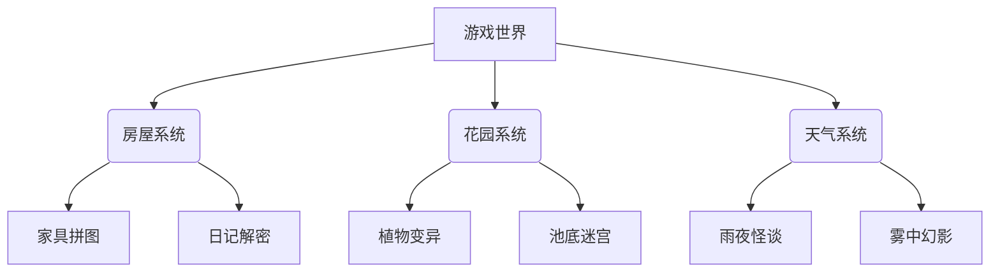

### 你的游戏设计方案

#### 1. 核心设计理念
- **孤独美学**：通过低饱和度配色、极简UI、环境音效营造疏离感
- **开放式探索**：无明确目标，通过碎片化叙事引发玩家思考
- **禅意交互**：慢节奏动作设计（如10秒浇花动画）

#### 2. 核心玩法模块



#### 3. 技术方案

**推荐引擎**：Godot 4.2 (MIT协议) + GDScript

**代码框架**：
```python
# 玩家控制器核心逻辑
extends CharacterBody2D

var speed = 100
var interaction_distance = 50

func _physics_process(delta):
	var direction = Input.get_vector("move_left", "move_right", "move_up", "move_down")
	velocity = direction * speed
	move_and_slide()
	
	if Input.is_action_just_pressed("interact"):
		var target = $RayCast2D.get_collider()
		if target and target.has_method("interact"):
			target.interact()
```

**场景架构**：
```
scenes/
├── house/
│   ├── living_room.tscn
│   └── bedroom.tscn
├── garden/
│   ├── pond_area.tscn
│   └── greenhouse.tscn
systems/
├── save_system.gd
└── weather_controller.gd
```

#### 4. 特色系统设计

**池底迷宫算法**：
```python
# 使用波函数坍缩算法生成随机水下迷宫
func generate_pond_maze():
	var tiles = []
	var size = 16
	var possibilities = []
	
	for x in range(size):
		for y in range(size):
			possibilities.append([
				Vector2(x, y),
				["up", "down", "left", "right"].filter(func(dir): 
					return randf() > 0.3
				)
			])
	
	while possibilities.size() > 0:
		var cell = possibilities.pick_random()
		var valid_dirs = cell[1]
		if valid_dirs.size() == 0:
			possibilities.erase(cell)
			continue
		
		var chosen_dir = valid_dirs[randi() % valid_dirs.size()]
		tiles.append({
			"position": cell[0],
			"path": chosen_dir
		})
		update_possibilities(cell, chosen_dir)
	
	return tiles
```

#### 5. 美术资源方案
- **角色动画**：使用Aseprite制作4方向行走图（128x128像素）
- **环境素材**：Kenney.nl的Nature Pack扩展包 + 自制破损家具素材
- **光影系统**：CanvasModulate + Light2D节点实现昼夜循环

#### 6. 同类GitHub项目推荐

1. **Loneliness Simulator**  
   `https://github.com/SomeUser/loneliness-sim`  
   核心价值：极简交互设计参考

2. **The Empty House**  
   `https://github.com/GameDevStudio/empty-house`  
   价值点：环境叙事实现方案

3. **Zen Garden Engine**  
   `https://github.com/ZenProjects/garden-engine`  
   亮点：植物生长模拟系统

#### 7. 开发路线图

**Phase 1 (2周)**：
- 基础场景搭建（房屋/花园碰撞体）
- 角色控制器实现
- 存档系统原型

**Phase 2 (4周)**：
- 池底迷宫生成算法
- 天气系统集成
- 基础音效系统

**Phase 3 (持续迭代)**：
- 碎片化叙事内容填充
- 植物变异系统
- Steam创意工坊支持

#### 8. 哲学层设计建议
- 在书架放置可交互的哲学书籍残页（加缪/卡夫卡节选）
- 雨夜出现随机哲学命题选择（影响环境色调）
- 镜子交互显示扭曲的玩家倒影

这种设计将游戏体验从单纯的环境交互提升到存在主义思考层面，符合"无聊"主题的深层表达需求。